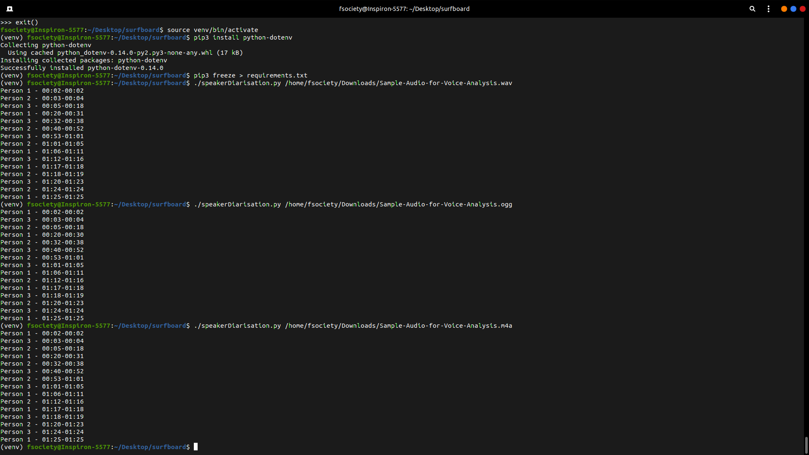

# SpeakerDiarisation-Python

**Speaker Diarization** is the process of segmenting and clustering a speech recording into homogeneous regions and answers the question “who spoke when” without any prior knowledge about the speakers. A typical diarization system performs three basic tasks. Firstly, it discriminates speech segments from the non-speech ones. Secondly, it detects speaker change points to segment the audio data. Finally, it groups these segmented regions into speaker homogeneous clusters. 

There are many Cloud Platforms which offer this service such as GCP, AWS, IBM, and many others. Some have paid subscription schemes and some are free. The one which caught my attention was IBM Cloud's Watson. Watson provides a free tier service with which we can make requests for 500 minutes a month!! They have direct URL access as well as with their Python SDK to the API.  

Go through the Watson Speech-to-text Documentation and play with the curl command to get a better understanding.

For us, we need to have speaker_labels as true under the aruguments in the URL,
```
curl -X POST -u "apikey:<APIKEY>" --header "Content-Type: audio/wav" --data-binary @<FILENAME.extension> "https://api.au-syd.speech-to-text.watson.cloud.ibm.com/instances/<instance_ID>/v1/recognize?speaker_labels=true"
```
Please note, the above command is just an example to show the argument used. Replace the APIKEY, filename and instance_ID accordingly.

### Usage:
"speakerDiarisation.py" takes in input as media file from the cmd argument. The file and it's format are validated and is sent as a POST request to the API. The response received is shown in "response_wav.json" & "response_ogg.json" files. This response is printed by using a logic to determine how long a speaker speaks.  
That data is printed in the form as shown below:
  

Formats supported: 
* mp3 
* flac 
* wav 
* m4a
* ogg
* mpeg
* aac

#### Follow the below Steps to run the program:
1. Create an IBM Cloud account & enable IBM Watson Speech-to-Text API. 
2. Download the credentials file, which will have the name as "ibm-credentials.env".  
(I can't stress enough on how important the documentation of the API is. Please, try running the curl commands before you run the program.)

3. IMPORTANT: Place the file in the same directory as the "speakerDiarisation.py" and rename the file to ".env".    


4. Also, you need to append the argument into the URL in the env file as below. Make sure you have instance_ID as your instance only.   
The ".env" should have content similar to:
```
SPEECH_TO_TEXT_APIKEY=<APIKEY>
SPEECH_TO_TEXT_IAM_APIKEY=<IAM_APIKEY>
SPEECH_TO_TEXT_URL='https://api.au-syd.speech-to-text.watson.cloud.ibm.com/instances/<instance_ID>/v1/recognize?speaker_labels=true'
SPEECH_TO_TEXT_AUTH_TYPE='iam'
```
Please use it only for reference!! Stick with your own ".env" file!!

5. Execute the below commands to run on Linux Terminal or Windows CMD  

Linux 
```
sudo chmod +x speakerDiarisation.py
pip3 install -r requirements.txt
./speakerDiarisation.py "/Path/of/file.extension" 
```
Windows

```
pip install -r requirements.txt
python speakerDiarisation.py "Path\of\file.extension"
```

Sample Recordings with different formats(ogg, wav, m4a, flac) under the recordings folder as well as sample Responses have been provided under the responses folder. 
